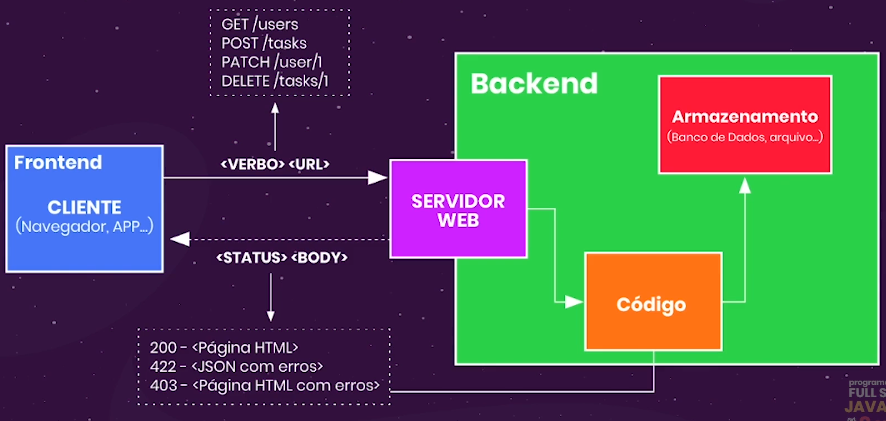

# Verbos
## HTTP é um protocolo de communicação web -> Protocolo possui verbos
- Verbos ajudam a identificar o tipo de ação quue queremos realizar em uma URL.
- URL pode ter mias de um verbo.
- GER/user pode exectar ação diferente que POST/user.

## Principais:
- GET       - Solicitar dados
- POST      - Cadastrar dados
- PUT/PATCH - Atualizar dados
- DELETE    - Deletar   dados

# Status
- Definir como uma requisição HTTP foi procesada
- Toda requisição tem uma resposta
- São códigos numéricos
## Família 100
- Respostas de informação: 
    - 100 Continue: tudo ocorreu bem até agora.
    - 101 Switching Protocol: protocolo está alternando.
    - 102 Processing: processando a requisição, nenhuma resposta  disponível.
    - 103 Early Hints: indicar o início de recursos enquanto o servidor prepara uma resposta
## Família 200
- Respostas de sucesso:
    - 200 OK: Estas requisição foi bem sucedida. Normalmente em resposta a um GET.
    - 201 Created: A requisição foi bem sucedida. Normalmente em resposta a um POST.
## Família 300
- Respsotas de redirecionamento.
## Família 400
- Mensagem de erro do cliente:
    - 400 Bad Request: Sintaxe inválida.
    - 401 Unauthorized: O cliente deve se autenticar.
    - 403 Forbidden: O cliente, autenticado, não tem direitos de acesso ao conteúdo/recurso.
    - 404 Not Found: Informação/recurso não encontrada no servidor não pode encontrar o recurso solicitado.
    - 422 Unprocessable Entity: A requisição está bem formada, mas possui erros semânticos.
## Família 300
- Respsotas de erro do servidor.

# Arquitetura Cliente-Servior com HTTP
