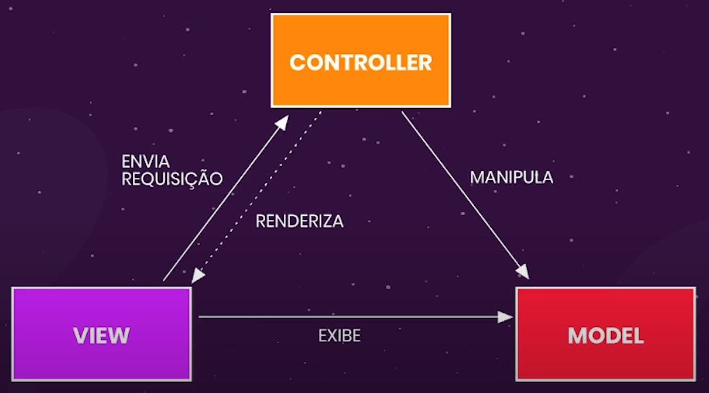
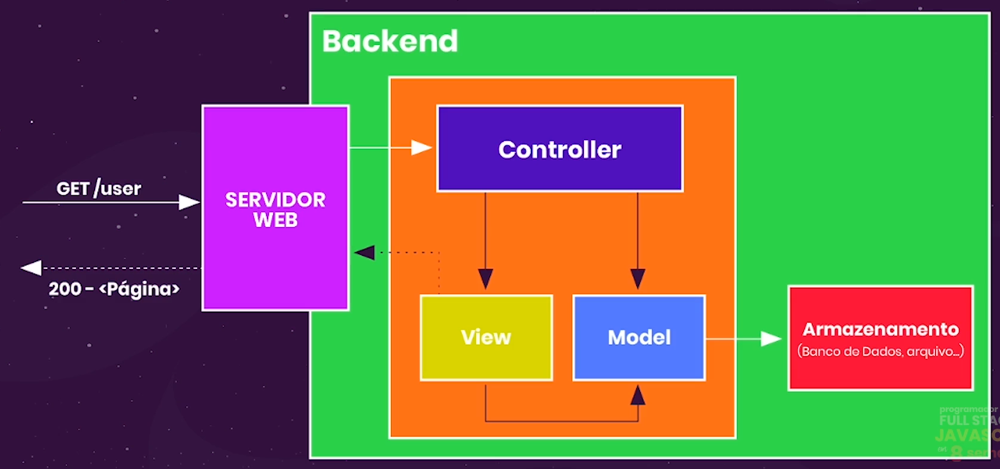

# Arquitetura MVC
- Forma de organização dos códigos do backend para que sajam facilmente:
    - Acessados pela web
    - Criados, desenvolvidos e melhorados
- MVC vem de **Model-View-Controller**
    - Padrão príncipal de arquitetura
    - Organizar nosso código separandos as **responsabilidades**
- Possui 3 responsabilidades principais:
    - **Model**: Lida com os dados, desde a leitura ao armazenamento e validação.
    - **View**: Exibição de dados para o usuário.
    - **Controller**: Recebe as requisições das views e chamar o model correto.  
- Uma pasta para cada um.

