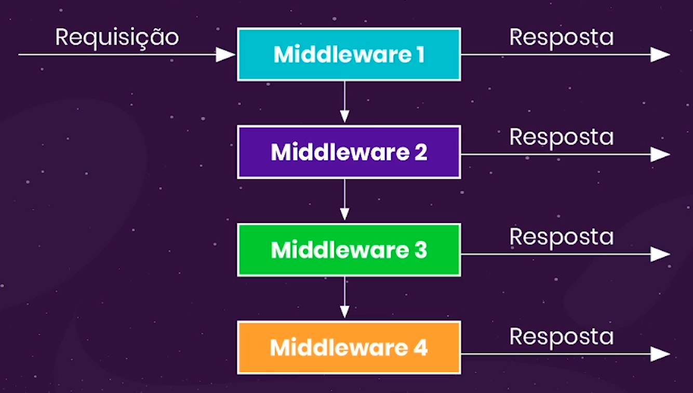

# Chain of Responsibility

- Significa "Cadeia de Responsabilidade"
- Para que objetos sejam encadeados e então verificar se pode-se enviar ruma resposta
    - Caso não passa para o próxima cadeia
- É padrão que o Express se baseou
    - Permite uma busca por uma resposta (dada uma requisição)
    
